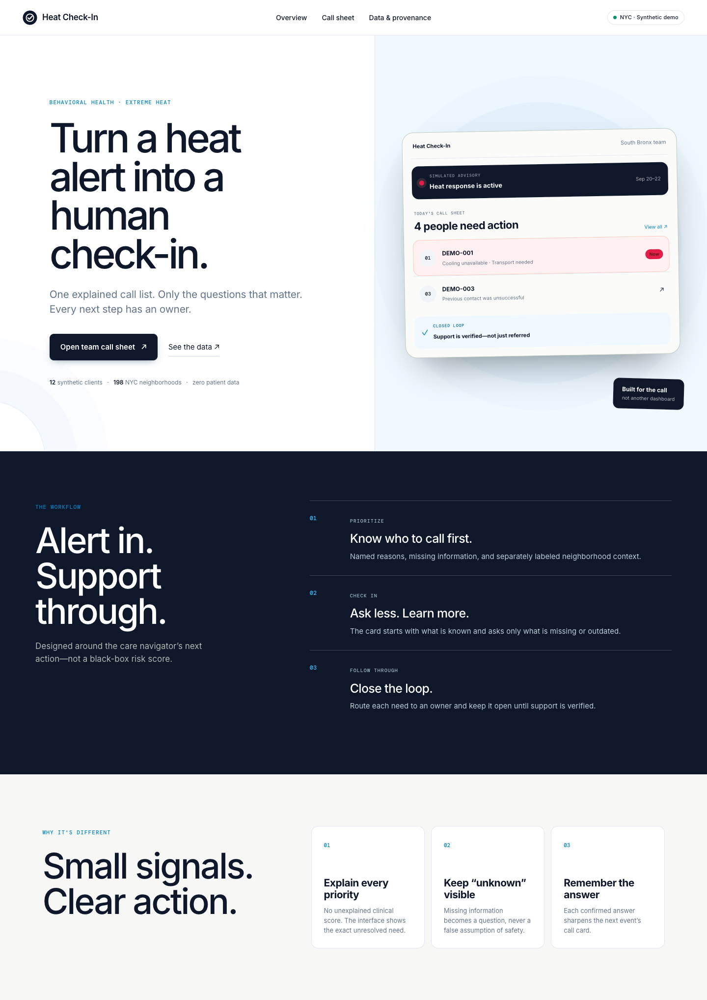
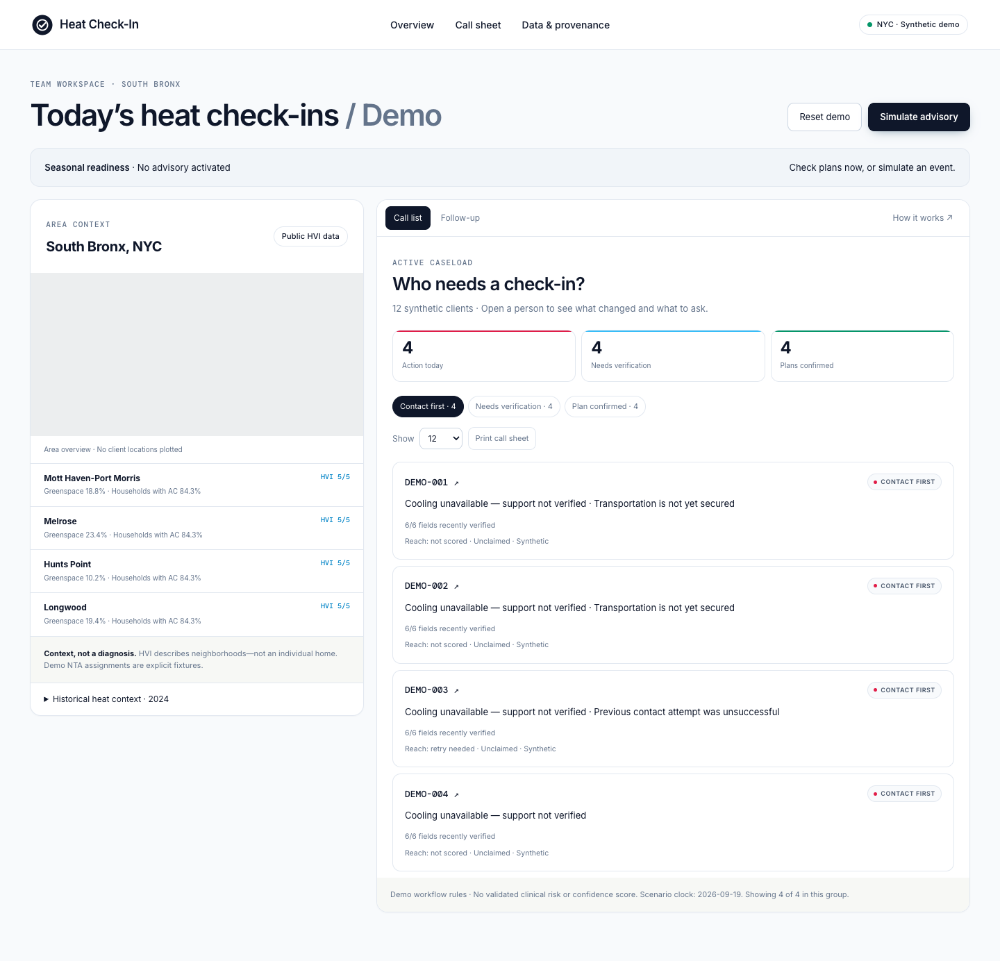

# Heat Check-In

A heat-response outreach list and follow-up tool for NYC behavioral-health care teams.

## Current status

A local interactive demo built with existing public data and explicitly synthetic clients. It has no external deployment, real patient data, or EHR connection.
The map and outreach list use a 50:50 layout. Selecting a client changes the right panel into the call card.

## Screens

To review the interface without running the app:

| Home | Team workspace / Call list |
|---|---|
|  |  |

(The map panel uses an OpenStreetMap iframe, so it may appear blank in screenshots captured without internet access. It loads when opened in a browser with network access.)

## Run locally

**Requirements:** Python 3.9+ only. No separate package installation (`pip install`) is required—the app uses the standard library.

```bash
git clone https://github.com/Hye-Seung-Kim/heat-check-in.git
cd heat-check-in
python3 -m http.server 8765 --bind 127.0.0.1 --directory dist
```

Open http://127.0.0.1:8765/ in a browser.

`dist/data/demo.json` is already built and committed, so the commands above are sufficient to run the demo. Run `scripts/prepare_data.py` only when you want to **regenerate** the synthetic clients and HVI snapshot—for example, to change the scenarios or provide a new client JSON file that follows `docs/06-data-contract.md`:

```bash
python3 scripts/prepare_data.py                              # Regenerate the default 12 synthetic clients
python3 scripts/prepare_data.py --clients my_clients.json   # Replace them with a custom client list
```

The script reads only cached source CSV files under `data-sources/` and runs without internet access. Only the map iframe and Google Fonts require the internet; all other data and font fallbacks load locally.

The demo uses four real HVI NTA records, 153 days of historical 2024 ED observations, and 12 explicitly synthetic clients.
The map is an OpenStreetMap area overview, not an HVI polygon layer.
Edits are stored in browser `localStorage`. The scenario date is fixed at 2026-09-19.

### Quick walkthrough

1. Select **Open team call sheet** on the home page.
2. Activate a simulated heat advisory with **Simulate advisory**.
3. Open a client in the `Contact first` group to review the call card: Why flagged, Known, Unknown, and adaptive questions.
4. Claim the client, save the call outcome, and update the owner and status under Follow-up.
5. Select **Reset demo** to return to the initial state. Storage is browser-specific, so a different browser or private window always starts fresh.

## Implemented

Home, call sheet, simulated advisory, separation of individual evidence from neighborhood context, claim workflow, consent verification, adaptive questions, call outcomes, retry tasks, editable owner and due date, support verification, browser storage, reset, and printing.

## Limitations

The Guide is static. LLM integration, arbitrary weighted scores, calibrated confidence, an official client adapter, and live alerts are not implemented. The decision table is for the synthetic demo and has not been reviewed by clinicians. Top-K controls how many clients are displayed within a group; it does not automatically exclude anyone from service.
The latest user-provided scope defines people with SMI/SUD as the target population, social workers and care teams as the users, and Heat Check-In as the product name.

## Documentation

- [Project brief](docs/01-project-brief.md)
- [User flow and open decisions](docs/02-user-flow.md)
- [Page structure and design direction](docs/03-page-spec.md)
- [Implementation scope and acceptance criteria](docs/04-build-plan.md)
- [Existing-data integration plan](docs/05-existing-data-plan.md)
- [Client-data replacement contract](docs/06-data-contract.md)
- [Original user-provided proposal](references/original-proposal.txt)

`references/01~03` are external visual references supplied by the user during the initial design phase (the Pharos product); they are not screens from this product.
Pharos branding, its UK clinical model, and its risk values are not used as product data. `references/04~05` are screenshots of the current interface.
